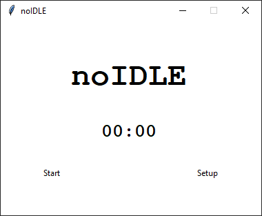
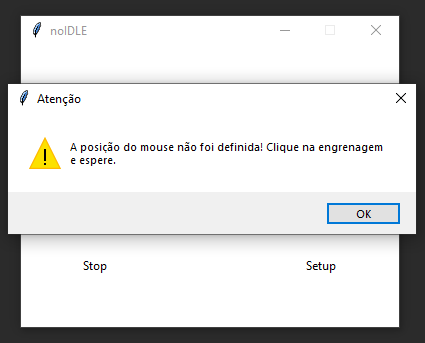

# **no IDLE**

Este projeto tem como objetivo impedir que o computador entre 
em modo de repouso clicando em um lugar selecionado de 30 em 30 segundos.

Para usar basta clicar em *SETUP* e esperar 5 segundos. Desta forma ele vai definir o local do click. 

Caso você click sem *START* sem clicar em *SETUP* primeiro ele vai apresentar uma mensagem de erro.

Após definir a posição de clique é só clicar em *START/STOP* para começar e parar os cliques.

